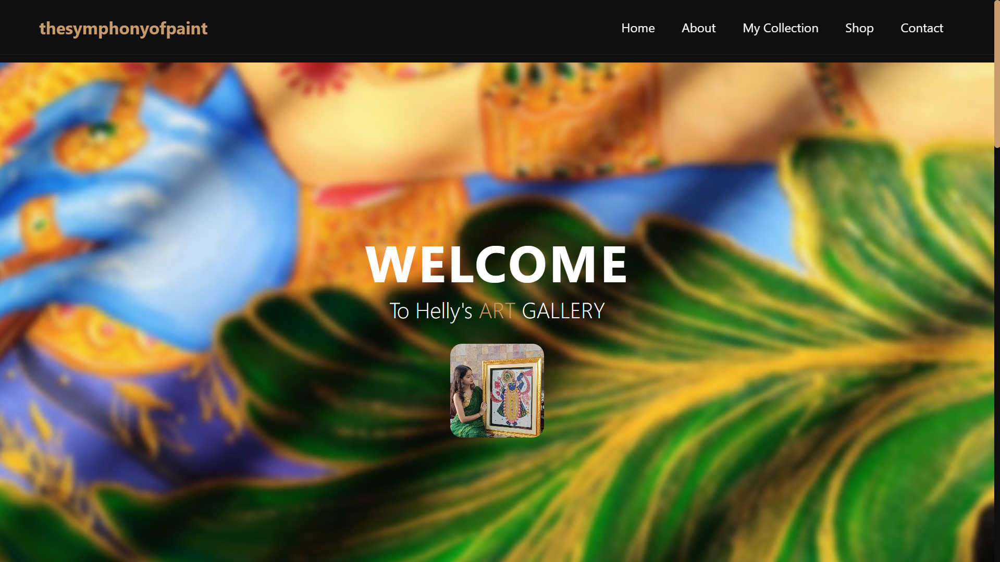
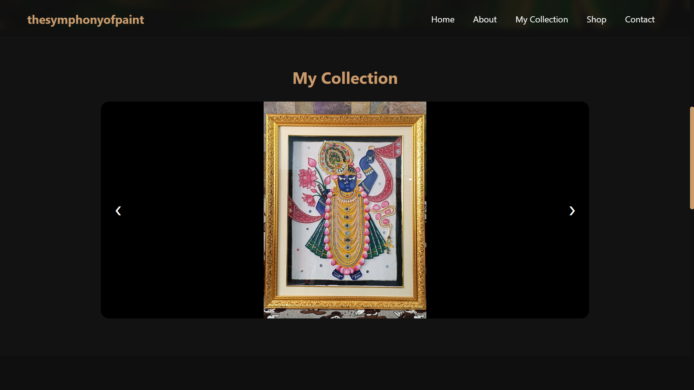
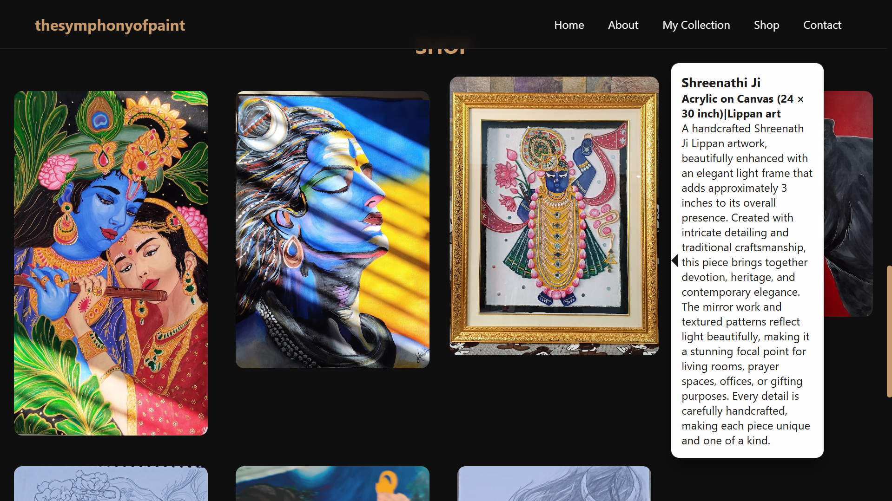

The Symphony of Paint

Welcome to **The Symphony of Paint**, my personal artist portfolio website showcasing handcrafted paintings, creative artwork, and my artistic journey.

This website is designed to provide visitors with an elegant and immersive experience while exploring my collection of paintings and learning more about my work.

Features

* 🎨 Beautiful landing page
* 🖼️ Artwork showcase
* 📖 About the Artist section
* 📱 Responsive design for desktop and mobile
* ✨ Smooth scrolling and modern UI
* 🌸 Minimalistic aesthetic inspired by fine art

Built With

* HTML
* CSS
* JavaScript

Project Structure

TheSymphonyOfPaint/
│
├── index.html
├── style.css
├── about.html
└── README.md

Purpose

The Symphony of Paint was created to provide a digital home for my artwork where visitors can:

* Explore my paintings
* Learn about my artistic journey
* Experience a clean and elegant design
* Connect with my work online

This project also serves as a demonstration of my front-end web development skills while combining technology with creativity.

Live Website

https://viramgamihelly.github.io/thesymphonyofpaint/

Preview

 About Me

Hi! I'm **Helly Viramgami**, an Information Technology student and passionate artist.

Through **The Symphony of Paint**, I aim to blend creativity with technology by building beautiful digital experiences while sharing my artwork with the world.

Connect With Me

* Instagram: **@thesymphonyofpaint._**
* GitHub: **https://github.com/viramgamihelly**

License

This project is created for portfolio and educational purposes.

© 2026 Helly Viramgami. All rights reserved.
